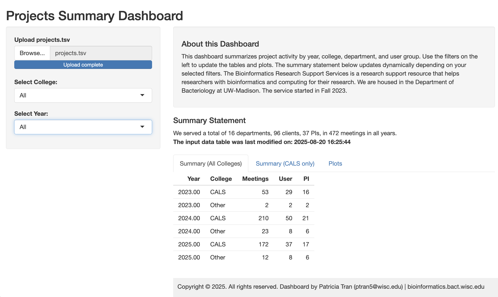

# Project-dashboard

## Description

Dashboard for consultation projects.

This is a R Shiny Dashboard created by Patricia Tran to summarize and report back on my main projects for my work in the Bioinformatics Research Support Service at UW-Madison.

The dashboard is inspired by the information from the Statistical Consulting Group at UW-Madison.

The data is private, but here is a preview of its functionality:

(**to do**) I've also included a subset of the data for the `projects.tsv` file so anyone can test the dashboard.

The \`projects.tsv\` file should have one consultation (entry) per row and contain at least the columns : Date (mdy), College (CALS or Other), Department, Lab (PI name), Name (name of the person seeking consultation).
